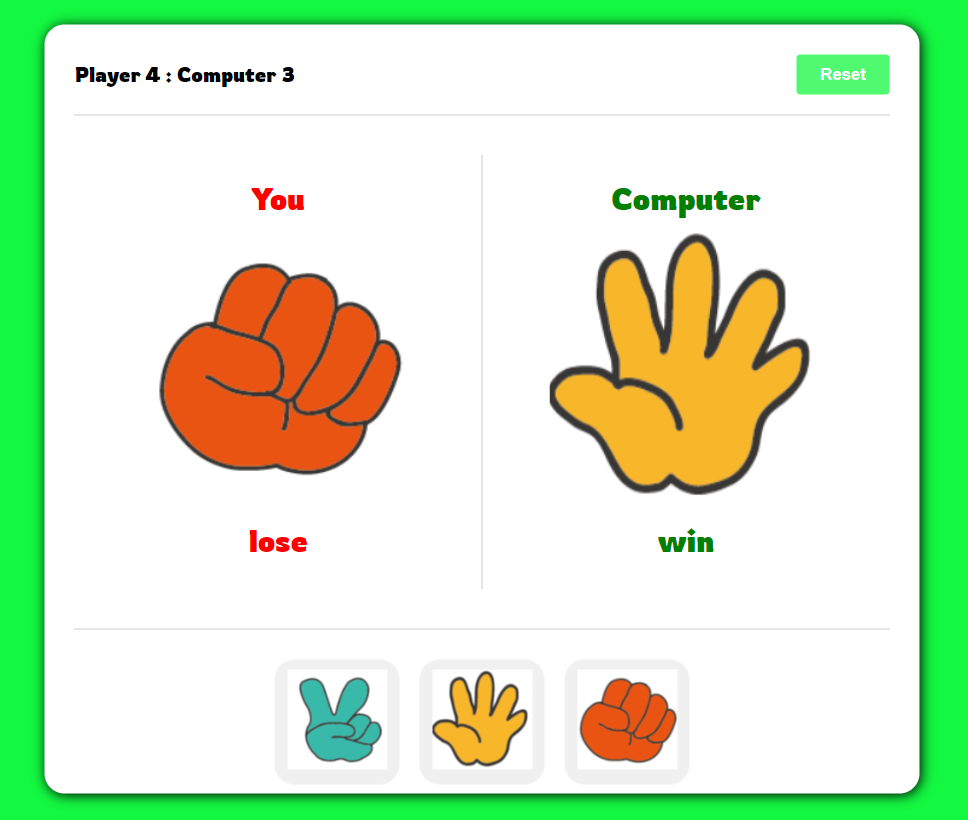

# HandBattle Game 🧐

A game project called HandBattle made using JavaScript, React, and CSS. It follows the same rules as the classic Rock, Paper, Scissors game. Users can select one of the items (Rock, Paper, Scissors), and the computer randomly selects one item. The outcome can be Win, Lose, or Tie. If the result is Win, the user scores 1 point. Scores can be reset at any time using the Reset button.

 

## Developer

|  |
| :----------------------------------------------------------------------------------------: |
|              Sung U Jung [@SungJung0616](https://github.com/SungJung0616)              |

 

## Deployment Address

[HandBattle Game](https://sj-handbattle.netlify.app/)

## ## Stacks

### Environment

 <

### Development

  

### Deployment

 

## Features

### JavaScript Utilization

- When the user selects an item via button click, the item is passed as a function parameter.
- The computer randomly selects an item when the user makes a choice.
- The user's and computer's items are compared to determine the winner.
- The winner is determined, and the score object is created, updated, and retrieved from local storage.

### React Utilization

- Components are designed and organized for reusability and manageability.
- Similar useState Hook values are created as objects to simplify the code.
- State items, win/loss status, and scores are assigned and updated using setState.
- Props are used to pass state values for rendering items, win/loss status, and scores.
- Ternary operators are used to check local storage and set scores accordingly.

### CSS Utilization

- The design and responsive work are done using CSS.
